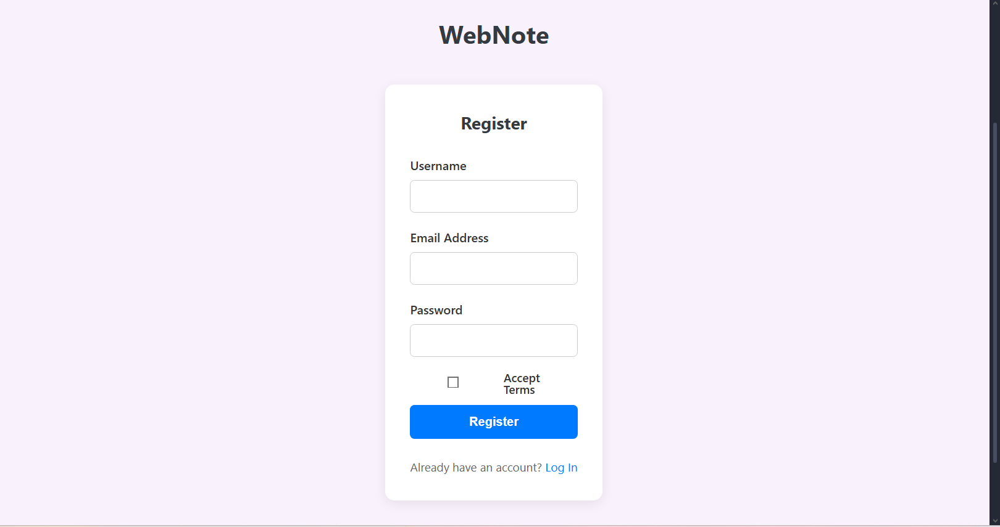
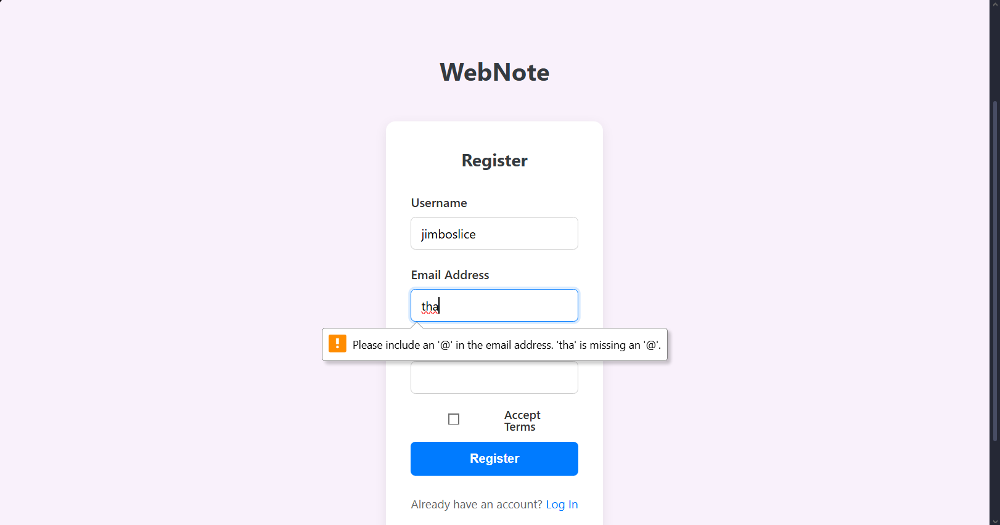
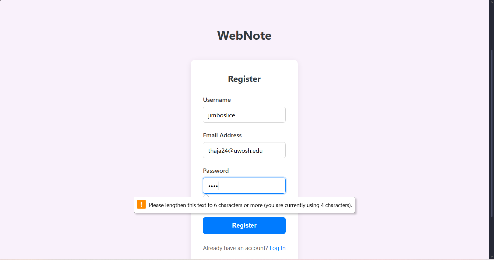
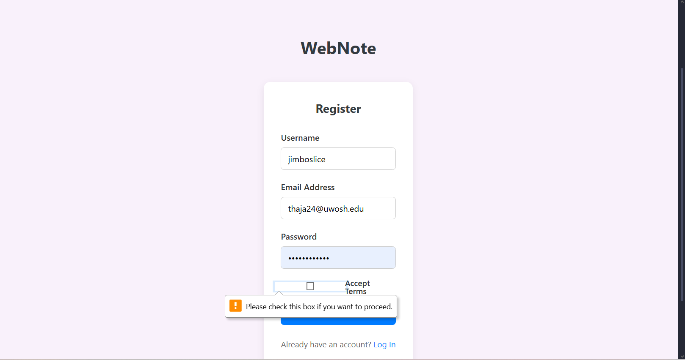
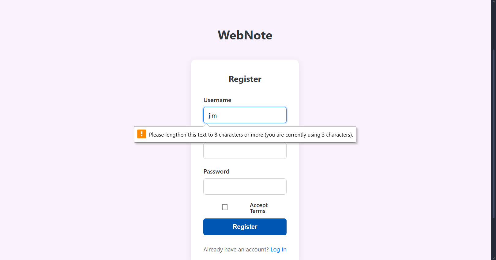

# CS346 Semester Project Template

A teaching template for building secure web applications with Node.js, Express, EJS, and PostgreSQL.

## Features

- 🚀 **Node.js 20** + **Express 4** - Modern JavaScript backend
- 🎨 **EJS** - Server-side templating
- 🗄️ **PostgreSQL** - Reliable relational database
- 🔒 **Security First** - Helmet, CSRF protection, secure sessions
- 📝 **Clean Code** - ESLint, Prettier, best practices
- 🎓 **Educational** - Well-documented, instructional code

## Quick Start

1. **Clone the repository**
   ```bash
   git clone <your-repository-url>
   cd cs346-semester-project-template
   ```

2. **Install dependencies**
   ```bash
   npm install
   ```

3. **Set up environment variables**
   ```bash
   cp .env.example .env
   # Edit .env with your database credentials
   ```

4. **Set up PostgreSQL database**
   ```bash
   # Create database (adjust credentials as needed)
   createdb your_database_name
   ```

5. **Run migrations**
   ```bash
   npm run migrate
   ```

6. **Seed database (optional)**
   ```bash
   npm run seed
   ```

7. **Start the application**
   ```bash
   npm run dev
   ```

8. **Open your browser**
   ```
   http://localhost:3000
   ```

## Project Structure

```
├── src/
│   ├── server.js           # Server entry point
│   ├── app.js              # Express app configuration
│   ├── routes/             # Route definitions
│   ├── controllers/        # Request handlers
│   ├── models/             # Database models
│   ├── views/              # EJS templates
│   └── public/             # Static files (CSS, JS, images)
├── db/
│   ├── migrations/         # Database migrations
│   ├── seeds/              # Database seeds
│   ├── migrate.js          # Migration runner
│   ├── seed.js             # Seed runner
│   └── reset.js            # Database reset script
├── docs/                   # Documentation
│   ├── README.md           # Documentation overview
│   ├── SETUP.md            # Setup guide
│   └── ARCHITECTURE.md     # Architecture details
├── .env.example            # Environment variables template
├── .eslintrc.json          # ESLint configuration
├── .prettierrc.json        # Prettier configuration
└── package.json            # Dependencies and scripts
```

## Available Scripts

- `npm start` - Start production server
- `npm run dev` - Start development server with auto-reload
- `npm run migrate` - Run database migrations
- `npm run seed` - Seed database with sample data
- `npm run reset` - Reset database (WARNING: deletes all data!)
- `npm run lint` - Check code for linting errors
- `npm run lint:fix` - Fix linting errors automatically
- `npm run format` - Format code with Prettier

## Security Features

- **Helmet**: Sets security-related HTTP headers
- **express-session**: Secure session management with httpOnly cookies
- **csurf**: Cross-Site Request Forgery (CSRF) protection
- **Parameterized SQL**: SQL injection prevention with prepared statements
- **Environment Variables**: Sensitive data kept out of source code

## Documentation

Comprehensive documentation is available in the `docs/` folder:

- [docs/README.md](docs/README.md) - Documentation overview
- [docs/SETUP.md](docs/SETUP.md) - Detailed setup instructions
- [docs/ARCHITECTURE.md](docs/ARCHITECTURE.md) - Architecture and design patterns

## Technology Stack

- **Runtime**: Node.js 20
- **Framework**: Express 4
- **Templating**: EJS
- **Database**: PostgreSQL (with pg driver)
- **Security**: Helmet, express-session, csurf
- **Development**: ESLint, Prettier, Nodemon

## Learning Resources

- [Express.js Documentation](https://expressjs.com/)
- [EJS Documentation](https://ejs.co/)
- [PostgreSQL Documentation](https://www.postgresql.org/docs/)
- [Node.js Documentation](https://nodejs.org/docs/)
- [OWASP Security Guide](https://owasp.org/)

## Contributing

This is a teaching template. Feel free to:
- Report issues
- Suggest improvements
- Submit pull requests
- Use it for your own projects

## License

ISC

## WEEK 7 UPDATES

- about.ejs - 
   - This page is just simple information about WebNote as a whole.
- index.ejs - 
   - This page serves as the homepage for the website.
- login.ejs - 
   - A simple login page with a submittable form.
- register.ejs - 
   - The register page consists of another submittable form.

## WEEK 8 UPDATES

- Database is hooked up, everything seems to be
  working fine as well.
- New "Notes Page" screen which will now
  consists of a form that the user is able to
  submit.
- JavaScript implementation: minimal interactivity
  so far, more will be coming soon however.
- Incremented branch name.

## WEEK 9 UPDATES

- There are now Hover and Focus states. Buttons and input
  fields have smooth hover/focus transitions.
- Added a check box onto the register page
- All input fields are now required with the built
  in error messages.
- Imported a Google Font
- Added an unDraw illustration
- 
- 
- 
- 
- 

## WEEK 10 UPDATES

- The database is now able to be interacted with through the "Notes List" and "Notes" webpages. The Notes List page fetches the available notes from the database and displays them, and the Notes page allows users to insert a note with a title into the database when they click the save button on that page.
- As for the RLS, we disabled it for now in Supabase, as well as commented out all code concerning the CSRF tokens.
- We will reintroduce the RLS in Supabase as well as restore the CSRF token system in the future once we set up user authentication. We have a "users" table in Supabase with a row for "id" that we will undoubtedly use for isolating user data once user authorization is added.
