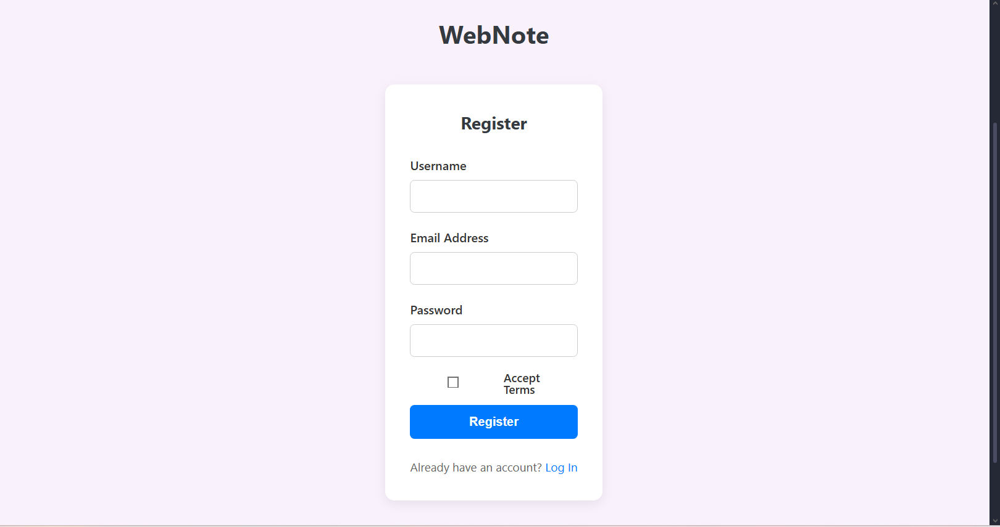
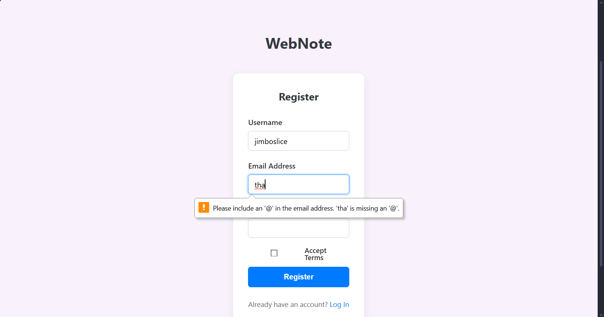
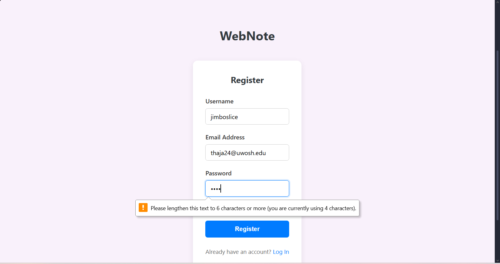
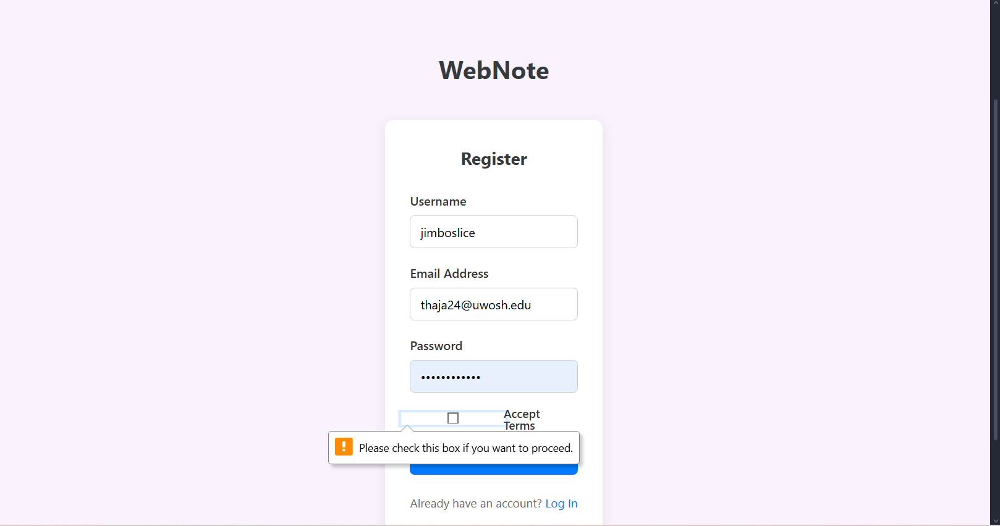
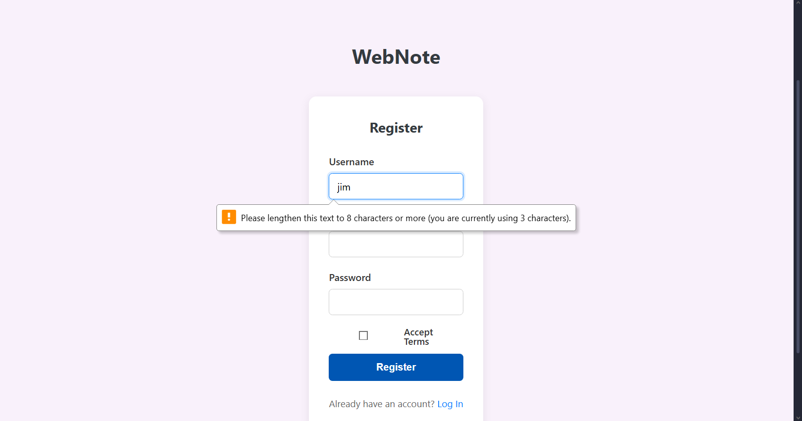
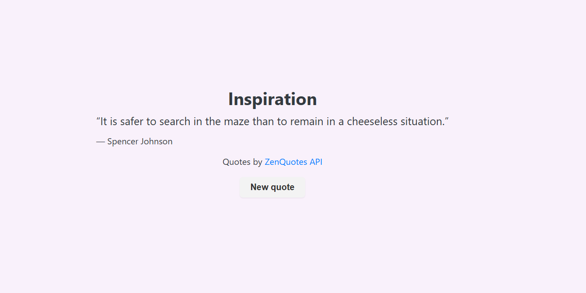

## Project Overview

- Purpose: The purpose of WebNote is to provide a simple and intuitive website that allows users to make and edit notes online, free of charge, and with no ads.
- Features: Users can add many notes that are marked with date and time, and are sorted by date created. These notes can be viewed/edited or deleted at will.
- The App's Abilities: Simply create an account and login, and create any notes that will then be available online at any time.

## Technical Architecture

- MVC: Model View Controller is a software architectural pattern consisting of user interfaces that interact with each other, dividing the related program logic into three interconnected elements (the elements being model, view, and controller).
- How WebNote uses it: The model is essentially the data structure of the app, the view is the web pages holding the HTML in this context, and the controller is used in routing, as in navigation between screens.
- Requests will go through the routes held in variables passed to the controller, and the view is loaded with the variables loaded to show the correct user's information.

## Local Setup Instructions

1. **Clone the repository**
   ```bash
   git clone <your-repository-url>
   cd cs346-semester-project-template
   ```

2. **Install dependencies**
   ```bash
   npm install
   ```

3. **Set up environment variables**
   ```bash
   cp .env.example .env
   # Edit .env with your database credentials
   ```

4. **Set up PostgreSQL database**
   ```bash
   # Create database (adjust credentials as needed)
   createdb your_database_name
   ```

5. **Run migrations**
   ```bash
   npm run migrate
   ```

6. **Seed database (optional)**
   ```bash
   npm run seed
   ```

7. **Start the application**
   ```bash
   npm run dev
   ```

8. **Open your browser**
   ```
   http://localhost:3000
   ```

## Error Handling Section

- The main types of errors the app expects are authentication errors or overflow errors. The csrf tokens are used everywhere in the code to identify each individual user, and more importantly keep track of which users have which notes shown to them. The errors are essentially handled by if the user is logged in, the csrf token is passed to all pages to prevent errors, but there are try/catch blocks in place to prevent issues anyways. 
- The overflow errors occur when a user enters too much text into a note, as there is a limit to the amount of text they can hold. They are handled by simply stating the error with a popup and discarding the note.

## Features

- 🚀 **Node.js 20** + **Express 4** - Modern JavaScript backend
- 🎨 **EJS** - Server-side templating
- 🗄️ **PostgreSQL** - Reliable relational database
- 🔒 **Security First** - Helmet, CSRF protection, secure sessions
- 📝 **Clean Code** - ESLint, Prettier, best practices
- 🎓 **Educational** - Well-documented, instructional code

## Project Structure

```
├── src/
│   ├── server.js           # Server entry point
│   ├── app.js              # Express app configuration
│   ├── routes/             # Route definitions
│   ├── controllers/        # Request handlers
│   ├── models/             # Database models
│   ├── views/              # EJS templates
│   └── public/             # Static files (CSS, JS, images)
├── db/
│   ├── migrations/         # Database migrations
│   ├── seeds/              # Database seeds
│   ├── migrate.js          # Migration runner
│   ├── seed.js             # Seed runner
│   └── reset.js            # Database reset script
├── docs/                   # Documentation
│   ├── README.md           # Documentation overview
│   ├── SETUP.md            # Setup guide
│   └── ARCHITECTURE.md     # Architecture details
├── .env.example            # Environment variables template
├── .eslintrc.json          # ESLint configuration
├── .prettierrc.json        # Prettier configuration
└── package.json            # Dependencies and scripts
```

## Available Scripts

- `npm start` - Start production server
- `npm run dev` - Start development server with auto-reload
- `npm run migrate` - Run database migrations
- `npm run seed` - Seed database with sample data
- `npm run reset` - Reset database (WARNING: deletes all data!)
- `npm run lint` - Check code for linting errors
- `npm run lint:fix` - Fix linting errors automatically
- `npm run format` - Format code with Prettier

## Security Features

- **Helmet**: Sets security-related HTTP headers
- **express-session**: Secure session management with httpOnly cookies
- **csurf**: Cross-Site Request Forgery (CSRF) protection
- **Parameterized SQL**: SQL injection prevention with prepared statements
- **Environment Variables**: Sensitive data kept out of source code

## Documentation

Comprehensive documentation is available in the `docs/` folder:

- [docs/README.md](docs/README.md) - Documentation overview
- [docs/SETUP.md](docs/SETUP.md) - Detailed setup instructions
- [docs/ARCHITECTURE.md](docs/ARCHITECTURE.md) - Architecture and design patterns

## Technology Stack

- **Runtime**: Node.js 20
- **Framework**: Express 4
- **Templating**: EJS
- **Database**: PostgreSQL (with pg driver)
- **Security**: Helmet, express-session, csurf
- **Development**: ESLint, Prettier, Nodemon

## WEEK 7 UPDATES

- about.ejs - 
   - This page is just simple information about WebNote as a whole.
- index.ejs - 
   - This page serves as the homepage for the website.
- login.ejs - 
   - A simple login page with a submittable form.
- register.ejs - 
   - The register page consists of another submittable form.

## WEEK 8 UPDATES

- Database is hooked up, everything seems to be
  working fine as well.
- New "Notes Page" screen which will now
  consists of a form that the user is able to
  submit.
- JavaScript implementation: minimal interactivity
  so far, more will be coming soon however.
- Incremented branch name.

## WEEK 9 UPDATES

- There are now Hover and Focus states. Buttons and input
  fields have smooth hover/focus transitions.
- Added a check box onto the register page
- All input fields are now required with the built
  in error messages.
- Imported a Google Font
- Added an unDraw illustration
- 
- 
- 
- 
- 

## WEEK 10 UPDATES

- The database is now able to be interacted with through the "Notes List" and "Notes" webpages. The Notes List page fetches the available notes from the database and displays them, and the Notes page allows users to insert a note with a title into the database when they click the save button on that page.
- As for the RLS, we disabled it for now in Supabase, as well as commented out all code concerning the CSRF tokens.
- We will reintroduce the RLS in Supabase as well as restore the CSRF token system in the future once we set up user authentication. We have a "users" table in Supabase with a row for "id" that we will undoubtedly use for isolating user data once user authorization is added.

## WEEK 11 UPDATES

- The CSRF token and user authentication now works properly, and user sessions are properly logged.
- Users are now able to register username, password, and email, as well as log in afterwards after confirming email via an email from Supabase after registration. Passwords are hashed in Supabase and cookies are configured as well.
- Logout button added which properly clears all cookies and user authentication data.
- Password strength field implemented.
- Visual "Welcome" message was added on homepage.

## WEEK 12 UPDATES

- API: ZenQuotes - GET https://zenquotes.io/api/random
- ROUTE: GET /api/inspire
- FLOW: Express route -> controller (the server side fetch) -> EJS view (inspire.ejs)
- Error Handling: try/catch
- Security: No API key required
- 
- Also implemented a few UI readability changes.

## WEEK 14 UPDATES 

- Most pages have been reworked with different color schemes, a new background, display changes, as well as various quality of life improvements such as eliminating the need to scroll down on most pages.

- The random old blue colors scattered throughout the app are gone and replaced with striped gray or black designs to stay consistent and add a little juxtaposition.

- Logging is now done in the console when loading many of the pages, such as login and register, as well as the ZenQuotes API Inspiration page.

- Comments have been added to the controllers to better explain certain code. 

- Comments in the stylesheet have been added to better explain some more non-trivial rulesets.

- Organized a bit of code, especially in the stylesheet where duplicate code was still hiding in spots. 